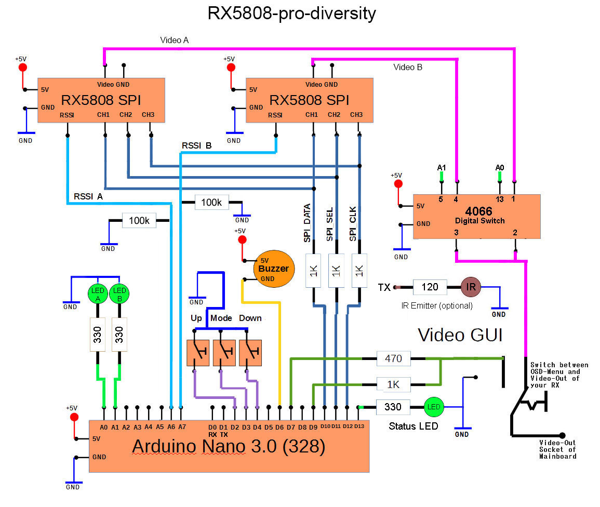

# 

This project is a fork of [rx5808-pro](https://code.google.com/p/rx5808-pro/) with support for diversity and much more.

Manufactured version of this project can be found at [La Forge FPV](http://www.laforgefpv.com)

The code is also backward compatible with the original rx5808-pro schematic minus diversity, dip switch mode and TV_Out. For details on updating click [here](/docs/diy-arduino-nano.md).

# Table of Contents
1. [Releases](#releases)
2. [Features](#features)
3. [Overview](#overview)
4. [Hardware](#hardware)
5. [Firmware](#firmware)
6. [Contributing](#contributing)
7. [License](#license)

# Releases
The latest release can be found here. [Latest Releases](https://github.com/sheaivey/rx5808-pro-diversity/releases)

# Features
- **User control** - 3 Button navigation, up, down, select.
- **Manual Mode** - Set channel manual
- **Search Mode** - Search next channel based on RSSI
- **Band Scanner** - Print spectrum of all 48 channels
- **Auto Save** - Saves settings after a few seconds of inactivity.
- **Beeper** - Acoustic feedback on important actions
- **RSSI Graph** - Running history of RSSI readings.
- **Diversity** - Receiver select and monitor.
- **Led Status** - Power, button pressed, active antenna.
- **Race Band & L-Band** - Total of 48 supported channels.
- **Backward Compatibility** - Use this code with your existing setup.
- **OLED Display** - Use a 128x64 OLED.
- **Setup Menu** - Creating changing settings (RSSI Calibration).

# Overview
Please watch the following video giving a detailed overview of the latest v2.0 release.

    

1. **Auto Scan** - Scans all bands until a signal with good signal strength is found.
2. **Manual Mode** - Will hold on a manually selected channel.
3. **Band Scanner** - Scans all bands and presents them with a signal strength bar graph.
5. **Settings Menu** - Saves last used channel and mode for next power cycle. This is also where you enter RSSI calibration mode.
    1. **Calibrate RSSI** - Calibrate the min and max RSSI values.

#### Initial Setup
When powering on for the first time it is best to calibrate your RSSI modules. No two modules have the same RSSI min and max readings. To calibrate follow these steps below. You can repeat this process as many times as needed.

1. Go to the settings menu and follow the calibrate RSSI steps on the screen.

# Hardware
#### Manufactured
If you are not looking to build your own hardware you can purchase manufactured versions from the following companies.

1. **[La Forge FPV](http://www.laforgefpv.com/vrx-pro)** - VRX-PRO
  - Designed by Shea Ivey
  - All Current Hardware versions.
2. Realacc - rx5808-pro-diversity
  - All current hardware versions.
3. FuriousFPV - True-D
  - V2.0 and earlier

#### DIY

This project is centered around the RX5808 5.8GHz receiver module which can be found at a number of online stores. The original rx5808-pro schematic has been modified to incorporate the diversity setup. Additional LEDs have also been added to show the active receiver.

For more information on specific hardware implementations:

1. [DIY Simple - Arduino Nano](/docs/diy-arduino-nano.md)
1. [DIY Intermediate - Custom Board (T-Box)](/docs/diy-through-hole-board.md)
2. [DIY Advanced - Custom Board](/docs/diy-custom-board.md)
1. [OLED Version - Arduino Nano](/docs/oled-arduino-nano.md)
3. [rx5808 SPI modification](/docs/rx5808-spi-mod.md)
6. [Voltage Monitoring](/docs/voltage-monitoring.md)

# Firmware
The firmware is constantly being improved please refer to the release history for more detailed information on improvements.
[Release History](https://github.com/sheaivey/rx5808-pro-diversity/releases)

# Contributing
Any contributions are welcome!

Please follow [CONTRIBUTING.md](CONTRIBUTING.md) for standard practices regarding this repo.

## Recognition
- SPI driver based on fs_skyrf_58g-main.c Written by Simon Chambers
- TVOUT by Myles Metzel
- Scanner by Johann Hermen (der-Frickler.net)
- Initial 2 Button version by Peter (pete1990)
- Refactored and GUI reworked by Marko Hoepken
- Universal version my Marko Hoepken
- Diversity Receiver Board and GUI improvements by Shea Ivey
- Adding Race Band by Shea Ivey
- Separating Display concerns for TVOut and OLED by Shea Ivey
- Adding Setup Menu by Shea Ivey
- DIY Throughole board and documentation. by RCDaddy
- Voltage monitoring by kabturek
- v2.0 Firmware Overhaul by @Knifa

# License
## Code
The code is distrubuted under the [MIT license](LICENSE.md).

## Logo
The logo is distributed under the [Creative Commons Attribution 4.0 International](http://creativecommons.org/licenses/by/4.0/) license.
