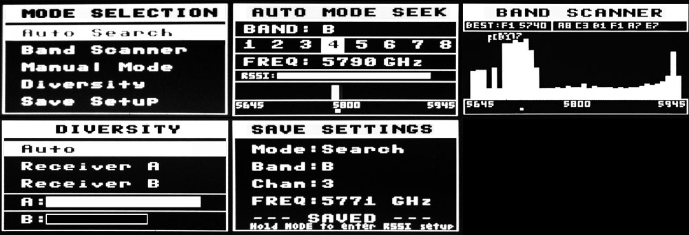
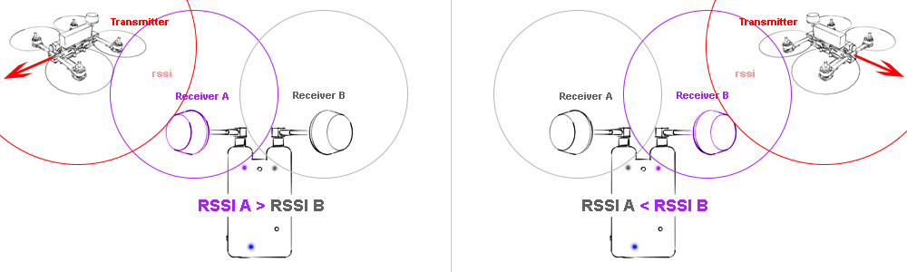

Manufactured version of this project can be found at [La Forge FPV](www.laforgefpv.com)

#Introduction
The main goal of this project is to add diversity to an already amazing feature set. Please see the following video for a quick intro of the project.

[](http://www.youtube.com/watch?v=NwnQCUikqvI)

The code is also now backward compatible with the original rx5808-pro schematic minus diversity and dip switch mode. For details on updating click [here](/docs/diy-arduino-nano.md).

This project originated [here](https://code.google.com/p/rx5808-pro/) and has been modified to include diversity receiver menu.

## Donations Welcome!
**Help fund more research and development into these great open source projects.**

[](https://www.paypal.com/cgi-bin/webscr?cmd=_s-xclick&hosted_button_id=GE83PG4KBZ5NJ)

Donations help show the developer your appreciation for all their hard work. A little goes a long way whether it is used for new hardware samples or better test equipment, you can be sure it will be put to good use.

## Table of Contents
1. [Features](#features)
2. [Usage](#usage)
3. [Hardware](#hardware)
4. [Software](#software)
5. [Contributing](#contributing)
6. [License](#license)


##Features
- **User control** - 3 Button navigation, up, down, select.
- **Manual Mode** - Set channel manual
- **Search Mode** - Search next channel based on RSSI
- **Scanner** - Print spectrum of all 40 channels
- **Save mode** - Save startup mode (manu, seek, scan)
- **Save channel** - Startup with last saved channel
- **Beeper** - Acustic feedback on important actions
- **Save RSSI range** - RSSI voltage may vary per part
- *(NEW)* **Quick Save** - From any home press and hold select for 1 second.
- *(NEW)* **Diversity** - Receiver select and monitor.
- *(NEW)* **Led Status** - Power, button pressed, active antenna.
- *(NEW)* **Race Band** - Added band C/Immersion Race for a total of 40 supported channels.
- *(NEW)* **Backward Compatibility** - Use this code with your existing setup.
- *(NEW)* **OLED Version** - Use a 128x64 OLED Display instead of TV_OUT.
- *(NEW)* **Setup Menu** - Creating menu for toggling settings.
- *(NEW)* **Voltage Alarm** - you can now use the built in buzzer for monitoring voltage
- *(REMOVED)* ~~**DIP mode** - Set channel by extern DIP switch~~

##Usage
####Screens



1. **Mode Select** - Use the up/down buttons to navigate. Hit mode to select. Don't press anything to return to the last mode selected.
2. **Auto Scan** - Scans all bands until a signal with good signal strength is found.
3. **Manual Mode** - Will hold on a manualy selected channel.
4. **Band Scaner** - Scans all bands and presents them with a sitnal strength bar graph.
5. **Diversity** - Select which receiver to use or auto. Also Displays signal strength of each antenna.
6. **Setup Menu** - Saves last used channel and mode for next power cycle. This is also where you enter RSSI calibration mode.
    1. **ORDER** - Change the Manual Mode channel seek order by frequency or channel number.
    2. **BEEPS** - Turn beeps on or off.
    3. **SIGN** - Edit your call sign. ( OLED Only )
    4. **Calibrate RSSI** - Calibrate the min and max RSSI values.
    5. **Voltage Alarm** - Change the warning/alarm voltage and calibration value.
    6. **Save & Exit**

####Initial Setup
When powering on for the first time it is best to calibrate your RSSI modules. No two modules have the same RSSI min and max readings. To calibrate follow these steps below. You can repeat this process as many times as needed.

1. Power on your receiver and transmitter and place them about 5 to 20 feet apart from one another. (For best results remove antennas to calibrate each module on a level playing field.)
2. Next navigate to the "Setup Menu".
3. Next navigate to "Calibrate RSSI".
4. Now that you are in the RSSI calibration screen, the receiver will scan all channels 3 times getting the min and max RSSI strength.
5. Once all 3 scans are complete you will be returned to the last home screen. You should now be able to have accurate RSSI readings and also auto scan to active channels.

##Hardware
This project is centered around the rx5808 5.8ghz receiver module which can be found at a number of online stores.

I have modified the original schematics to incorporate the diversity setup.

I have also added LEDs to represent which antenna is currently being selected.


For more information on specific hardware implementations:

1. [DIY Simple - Arduino Nano](/docs/diy-arduino-nano.md)
1. [DIY Intermediate - Custom Board (T-Box)](/docs/diy-through-hole-board.md)
2. [DIY Advanced - Custom Board](/docs/diy-custom-board.md)
1. [OLED Version - Arduino Nano](/docs/oled-arduino-nano.md)
3. [rx5808 SPI modification](/docs/rx5808-spi-mod.md)
6. [Voltage Monitoring](/docs/voltage-monitoring.md)

##Software
The major software changes are centered around the diversity menu. This required removing the dip switch mode from the origional project. Within the diversity menu you will find RSSI signal strength for each receiver and the ability to select which mode the receivers are operating in (Auto, Receiver A, Receiver B).

The following values control how often we switch receiver in diversity auto mode.

```
// rssi strenth should be 2% greater than other receiver before switch.
// this pervents flicker when rssi values are close and delays diversity checks counter.
#define DIVERSITY_CUTOVER 2

// number of checks a receiver needs to win over the other to switch receivers.
// this pervents rapid switching.
// 1 to 10 is a good range. 1 being fast switching, 10 being slow 100ms to switch.
#define DIVERSITY_MAX_CHECKS 5
```

The diversity switching logic is simple.
```
If Receiver A is greater than Receiver B by two percent
  check_counter-- // receiverA win
else
  check_counter++ // receiverB win

If check_counter is zero
    Set receiverA as active receiver.
If check_counter is DIVERSITY_MAX_CHECKS
    Set receiverB as active receiver.
```


The two percent helps prevent rapid video switching when both RSSI are close in value.


##Contributing
Any contributions are welcome!

Please follow [CONTRIBUTING.md](CONTRIBUTING.md) for standard practices regarding this repo.

##License & Recognition
####Recognition
- SPI driver based on fs_skyrf_58g-main.c Written by Simon Chambers
- TVOUT by Myles Metzel
- Scanner by Johann Hermen (der-Frickler.net)
- Initial 2 Button version by Peter (pete1990)
- Refactored and GUI reworked by Marko Hoepken
- Universal version my Marko Hoepken
- Diversity Receiver Board and GUI improvements by Shea Ivey
- Adding Race Band by Shea Ivey
- Separating Display concerns for TVOut and OLED by Shea Ivey
- Adding Setup Menu by Shea Ivey
- DIY Throughole board and documentation. by RCDaddy
- Voltage monitoring by kabturek

####License
The MIT License (MIT)

Permission is hereby granted, free of charge, to any person obtaining a copy
of this software and associated documentation files (the "Software"), to deal
in the Software without restriction, including without limitation the rights
to use, copy, modify, merge, publish, distribute, sublicense, and/or sell
copies of the Software, and to permit persons to whom the Software is
furnished to do so, subject to the following conditions:

The above copyright notice and this permission notice shall be included in all
copies or substantial portions of the Software.

THE SOFTWARE IS PROVIDED "AS IS", WITHOUT WARRANTY OF ANY KIND, EXPRESS OR
IMPLIED, INCLUDING BUT NOT LIMITED TO THE WARRANTIES OF MERCHANTABILITY,
FITNESS FOR A PARTICULAR PURPOSE AND NONINFRINGEMENT. IN NO EVENT SHALL THE
AUTHORS OR COPYRIGHT HOLDERS BE LIABLE FOR ANY CLAIM, DAMAGES OR OTHER
LIABILITY, WHETHER IN AN ACTION OF CONTRACT, TORT OR OTHERWISE, ARISING FROM,
OUT OF OR IN CONNECTION WITH THE SOFTWARE OR THE USE OR OTHER DEALINGS IN THE
SOFTWARE.
