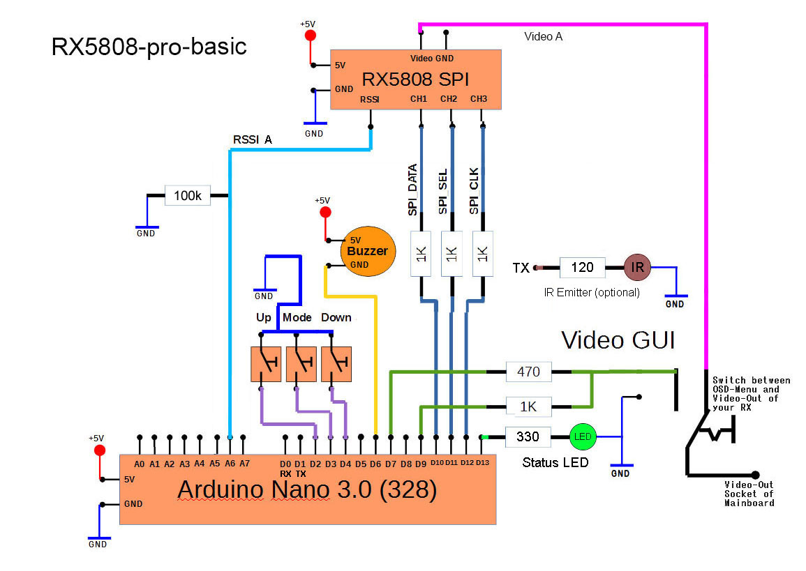

#DIY Simple - Arduino Nano

####BOM
- 4x 1k resistor
- 1x 470 resistor
- 3x 330 resistor
- 2x rx5808 receiver with [spi mod](rx5808-spi-mod.md)
- 3x LEDs
- 3x Momentary switch
- 1x Toggle switch
- 1x Buzzer
- 1x 4066 digital switch chip
- 1x Arduino Nano 3.0 328

####Schematic


#DIY Basic - Arduino Nano (Not Diversity)
You can comment out the following line to remove the diversity menu from the GUI. (Note the dip mode is still not implemented.)
```
#define USE_DIVERSITY
```

####BOM
- 4x 1k resistor
- 1x 470 resistor
- 1x 330 resistor
- 1x rx5808 receiver with [spi mod](rx5808-spi-mod.md)
- 1x LEDs
- 3x Momentary switch
- 1x Toggle switch
- 1x Buzzer
- 1x Arduino Nano 3.0 328

####Schematic

