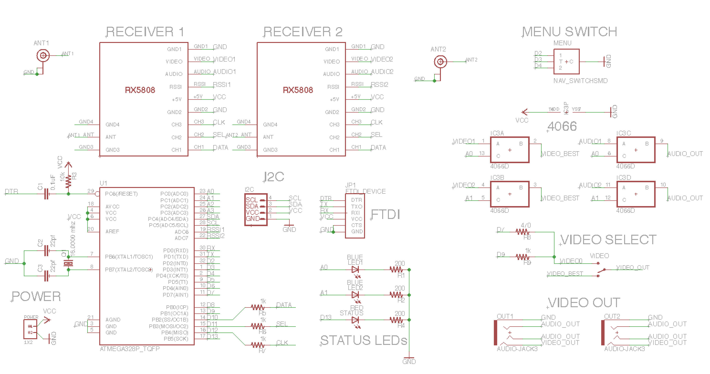
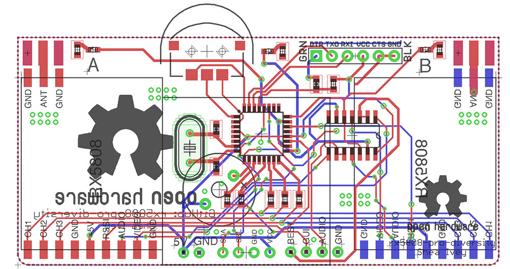
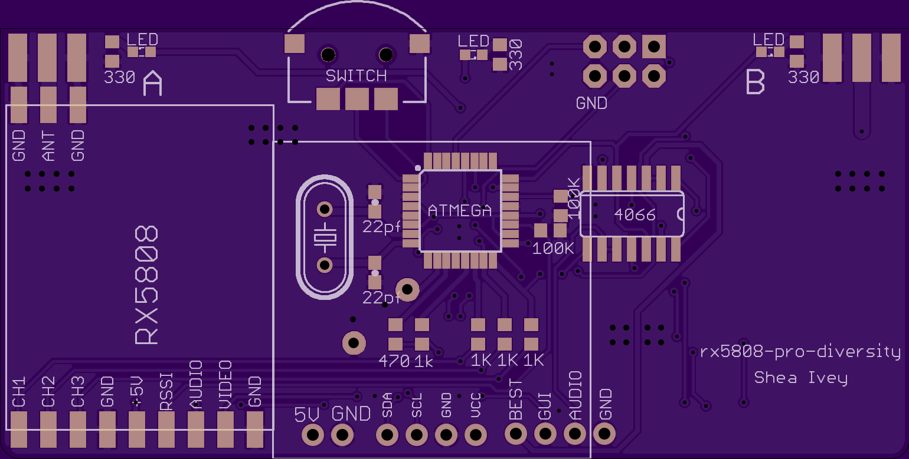
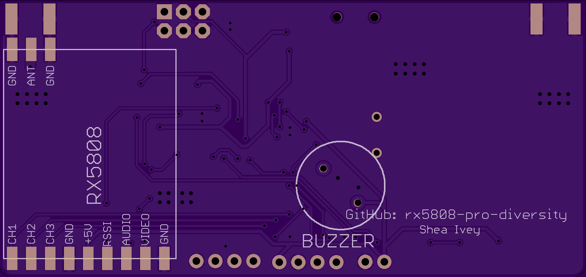
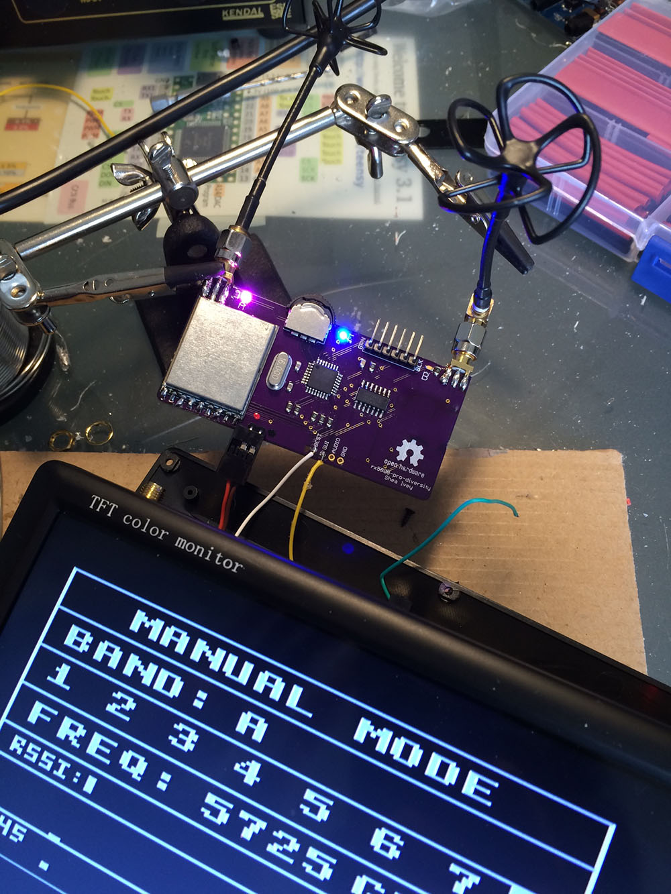

#DIY Advanced - Custom Board
This requires ordering a board from [https://oshpark.com/shared_projects/7J17i6at](https://oshpark.com/shared_projects/7J17i6at)
No bootloader is nessissary with this board. Program the board using the SPI breakout pins. (Select Arduino Pro Mini 5v 328 as the board)

####BOM
- 4x 1K ohm resistor 0805 [Mouser](http://www.mouser.com/Search/ProductDetail.aspx?R=ERJ-6ENF1001Vvirtualkey66720000virtualkey667-ERJ-6ENF1001V)
- 1x 470 ohm resistor 0805 [Mouser](http://www.mouser.com/Search/ProductDetail.aspx?R=ERJ-6ENF4700Vvirtualkey66720000virtualkey667-ERJ-6ENF4700V)
- 3x 330 ohm resistor 0805 [Mouser](http://www.mouser.com/Search/ProductDetail.aspx?R=ERJ-6ENF3300Vvirtualkey66720000virtualkey667-ERJ-6ENF3300V)
- 2x 100k ohm resistor 0805 [Mouser](http://www.mouser.com/Search/ProductDetail.aspx?R=ERJ-6ENF1003Vvirtualkey66720000virtualkey667-ERJ-6ENF1003V)
- 2x 22pf capacitor 0805 [Mouser](http://www.mouser.com/Search/ProductDetail.aspx?R=C0805C220J5GACTUvirtualkey64600000virtualkey80-C0805C220J5G)
- 1x 16.0000mhz crystal [Mouser](http://www.mouser.com/Search/ProductDetail.aspx?R=FOXSLF%2f160-20virtualkey55910000virtualkey559-FOXS160-20-LF)
- 2x rx5808 receiver with [spi mod](rx5808-spi-mod.md)
- 2x Blue LEDs 0805 [Mouser](http://www.mouser.com/Search/ProductDetail.aspx?R=LTST-C170KRKTvirtualkey57820000virtualkey859-LTST-C170KRKT)
- 1x Red LED 0805 [Mouser](http://www.mouser.com/Search/ProductDetail.aspx?R=LTST-C170TBKTvirtualkey57820000virtualkey859-LTST-C170TBKT)
- 1x [Navigation switch](https://www.sparkfun.com/products/8184) or [ebay](http://www.ebay.com/itm/231618098407?ul_noapp=true)
- 2x SMA Connector [Mouser](http://www.mouser.com/Search/ProductDetail.aspx?R=132289virtualkey52330000virtualkey523-132289)
- 1x 4066D SO14 digital switch chip SMD [Mouser](http://www.mouser.com/Search/ProductDetail.aspx?R=74LVC4066D%2c118virtualkey66800000virtualkey771-74LVC4066D-T)
- 1x MEGA 328 TQFP [Mouser](http://www.mouser.com/Search/ProductDetail.aspx?R=ATMEGA328-AUvirtualkey55660000virtualkey556-ATMEGA328-AU)
- 1x Active Buzzer (Optional)
- 1x OLED 128x64 display I2C (5v tollerant) (Optional - If you don't want to do TV_Out)

[Mouser cart](http://www.mouser.com/ProjectManager/ProjectDetail.aspx?AccessID=9f6e677f02) with everything but rx5808, navigation switch and optional parts.

####Schematic

####Board
Silk:

Top:

Bottom:

####Example
Below is an example of the board installed into a 7" monitor. This board will also fit into a 5" monitor. There are two outputs one for the currently active rx5808 module. The other is the GUI that from the ATMEGA 328 chip.

This monitor has two inputs and a source button on the front for switching between the video signals. If your monitor does not allow for two inputs you can use a toggle switch to acheive the same result.

