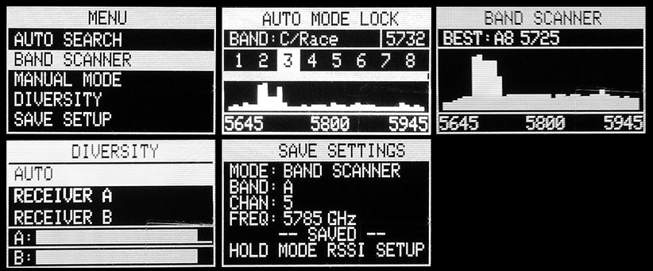
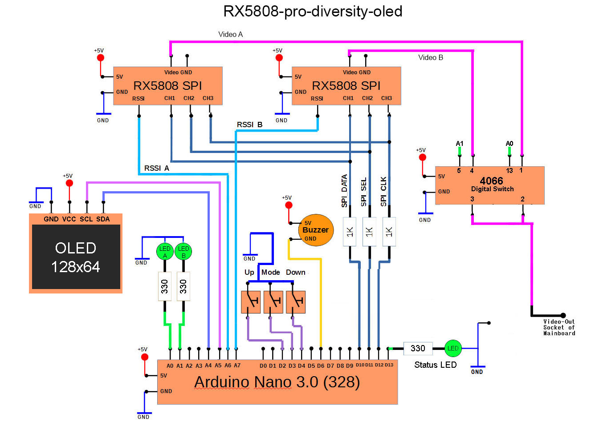
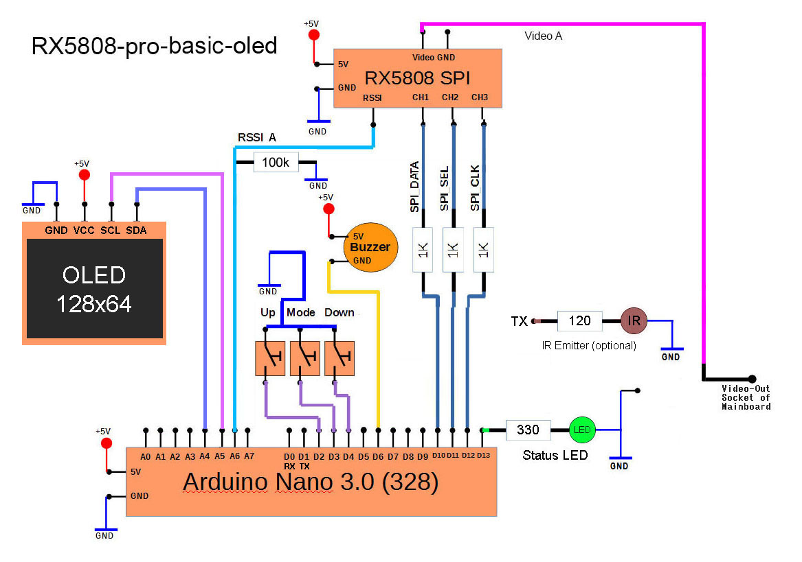

#OLED Screen Shots


#Source Code
[Enclosure Documentation](../src/rx5808-pro-diversity-oled/rx5808-pro-diversity-oled.ino)
You will need the following Adafruit libraries: 
```
Adafruit_SSD1306.h
Adafruit_GFX.h
```
#OLED Simple - Arduino Nano

####BOM
- 3x 1k resistor
- 3x 330 resistor
- 2x rx5808 receiver with [spi mod](rx5808-spi-mod.md)
- 3x LEDs
- 3x Momentary switch
- 1x Toggle switch
- 1x Buzzer (optional)
- 1x 4066 digital switch chip
- 1x Arduino Nano 3.0 328
- 1x OLED 128x64 display (5v tollerant)

####Schematic


#OLED Basic - Arduino Nano (Not Diversity)
You can comment out the following line to remove the diversity menu from the GUI. (Note: dip mode is still not implemented.)
```
#define USE_DIVERSITY
```

####BOM
- 3x 1k resistor
- 1x 330 resistor (optional)
- 1x rx5808 receiver with [spi mod](rx5808-spi-mod.md)
- 1x LEDs (optional)
- 3x Momentary switch
- 1x Toggle switch
- 1x Buzzer (optional)
- 1x Arduino Nano 3.0 328
- 1x OLED 128x64 display (5v tollerant)

####Schematic

