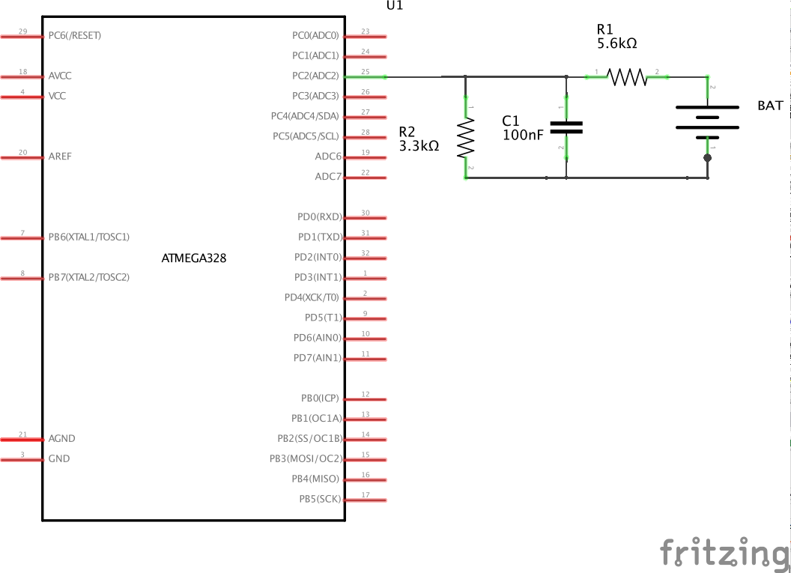

#Voltage Monitoring
You can monitor voltages of the attached battery by using any of the arduino analog pins and a voltage divider to lower the voltage to safe levels (5v). You have to enable (uncomment) "#define USE_VOLTAGE_MONITORING" and change "#define VBAT_PIN A2" to the pin you will be using.

Lets take the [DIY Advanced - Custom Board](/docs/diy-custom-board.md) as an example. Atmega 328 has 8 analog inputs (or 6 if youre using the DIP package) - A4 and A5 are used for controlling the oled if you're using one, A6 and A7 are used for measuring RSSI. There are no more easily accesible analog pins on the advanced board - you will have to solder a wire directly to the processor pins. The default pin depends on the screen output - A2 for oled ( on the edge of atmega chip - easier to hand solder) or A4 when TVout is used - use pad SDA on custom board.

Now you have to create a simple voltage divider circuit - let's assume a 3S battery (12.6V max) and use standard resistor values - using R1 = 5.6K and R2 = 3.3K will allow us to connect a battery with voltage of around 13.4V (keep in mind the resistors have 5% tolerance so it's good to have some margin). The cap is optional - it will smooth the voltage readings.

Here is a picture of a voltage divider on the advanced board using an OLED:

